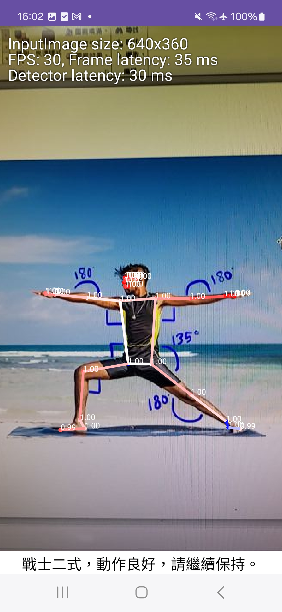

Android 運動姿勢建議APP
-------------

1. 使用ML Kit的Pose Detection
2. 右滑可點選動作選擇選單
3. 動作不標準即時提供修改建議
4. 動作-戰士一式偵測
5. 動作-戰士二式偵測
6. 動作-平板式偵測

| 動作選擇 | 戰士一式 |
| :----: | :----: |
|  | |

| 戰士二式 | 平板式 |
| :----: | :----: |
|  | |

| 戰士2式_動作糾正建議 | 戰士2式_動作糾正建議2 |
| :----: | :----: |
|  | |
